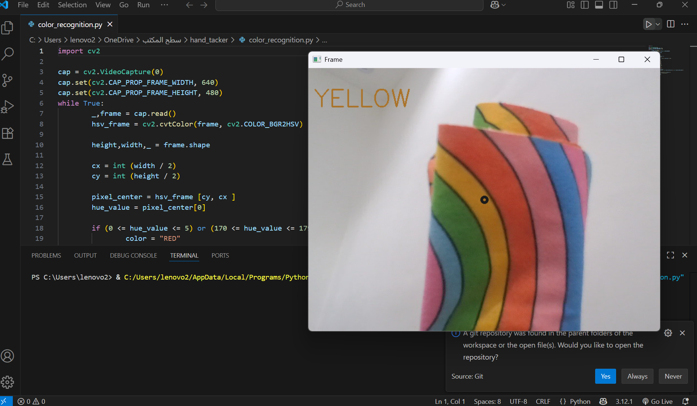

# Color Detection using OpenCV

A basic Python project that detects the color at the center of the webcam screen using OpenCV.

## Project Idea

- Automatically opens the webcam.
- Displays a small dot at the center of the screen.
- Detects the color behind the dot.
- Shows the name of the detected color at the top of the screen, with the text colored accordingly.

## Requirements
- Python 3.x  
- OpenCV (`pip install opencv-python`)

## 📁 Project Files

- [color_recognition.py](./color_recognition.py) 
- README.md ← this file

## Screenshot Example

